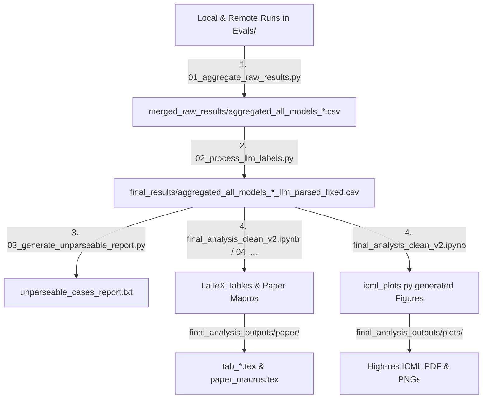

# Context Robustness in Cultural Norm Reasoning

Welcome to the **Context Robustness in Cultural Norm Reasoning** codebase. This repository contains the complete experimental suite, evaluation scripts, data pipelines, and statistical analysis tools used to evaluate and analyze the robustness of Large Language Models (LLMs) when reasoning about cultural norms on the **NormAd** dataset.

The codebase is organized into a modular, highly structured, and fully self-contained layout optimized for execution and reproduction.

---

## ─── Codebase Structure ───

The submission is organized as follows:

```
Context-Robustness_to_submit/
├── README.md                      # Premium execution and layout documentation (this file)
├── requirements.txt                # Unified list of python dependencies
├── Evals/                         # Standalone evaluation suites for models
│   ├── Cohere/                    # Remote Cohere API models (Tiny Aya, Command-A)
│   │   ├── data_india/            # Raw inputs & unaggregated CSVs for India
│   │   ├── data_turkey/           # Raw inputs & unaggregated CSVs for Turkey
│   │   ├── data_vietnam/          # Raw inputs & unaggregated CSVs for Vietnam
│   │   ├── experiment_india_normad_fixed.ipynb
│   │   ├── experiment_turkey_normad_fixed.ipynb
│   │   └── experiment_vietnam_normad_fixed.ipynb
│   ├── Qwen3.5_0.8B_2B/           # Local Qwen3.5 0.8B & 2B HuggingFace runner & results
│   │   ├── data/                  # India, Turkey, and Vietnam templates
│   │   ├── results/               # Raw outputs (0.8B & 2B, reasoning/non-reasoning)
│   │   └── local_evals_qwen.py    # Local evaluation execution script
│   └── Qwen3.5_9B_Gemma4/         # Local Qwen3.5 9B & Gemma-4-31B results (kept empty for external scripts)
│       └── results/               # Raw outputs (9B & 31B, reasoning/non-reasoning)
└── Aggregation_Parsing_LLM_outputs/# Data standardization, LLM-based parsing, & ICML analysis
    ├── final_results/             # Final cleaned, LLM-repaired, and standardized CSV datasets
    ├── merged_raw_results/        # Intermediate raw aggregated model outputs
    ├── final_analysis_clean_v2.ipynb# Core statistical analysis, LaTeX exporter, and ranking engine
    ├── analysis_helpers.py        # Utility library (Holm-Bonferroni, McNemar statistical tests)
    ├── 01_aggregate_raw_results.py# Global aggregator to compile all model outputs relative to Evals
    ├── 02_process_llm_labels.py   # Resilient, batch LLM label repair and parsing script
    ├── 03_generate_unparseable_report.py# Repair audit and data-cleaning report generator
    ├── 04_generate_analysis_numbers.py# Script to compute LaTeX tables and paper macros
    ├── unparseable_cases_report.txt# Summary of data audit findings
    └── icml_plots.py              # Standalone publication-quality graphics engine
```

---

## ─── Environmental Setup ───

To set up your environment, install the unified list of packages in `requirements.txt`:

```bash
pip install -r requirements.txt
```

> [!NOTE]
> If you are using an Apple Silicon Mac (M1/M2/M3), ensure you have installed a PyTorch version supporting the `mps` backend for local model accelerations.

---

## ─── Analysis Pipeline Workflow ───

The data flow from raw model evaluations to final ICML paper assets follows a sequential, modular process:



### Step 1: Aggregate All Models
Run the unified aggregation script to compile the unaggregated Cohere core runs, the local Qwen3.5 0.8B/2B results, and the Qwen3.5 9B/Gemma-4 results into a single file per country:
```bash
cd Aggregation_Parsing_LLM_outputs
python3 01_aggregate_raw_results.py
```
*This outputs `aggregated_all_models_{country}.csv` into `Aggregation_Parsing_LLM_outputs/merged_raw_results/`.*

### Step 2: Run LLM-Based Label Repair & Parsing
Models can sometimes output verbose, conversational filler instead of clean options. Parse and standardize these raw responses into clean labels (`"yes"`, `"no"`, `"neutral"`) using structured batching:
```bash
python3 02_process_llm_labels.py
```
*This repairs and standardizes all outputs, writing `aggregated_all_models_{country}_llm_parsed_fixed.csv` into `Aggregation_Parsing_LLM_outputs/final_results/`.*

### Step 3: Audit Repair Success
Produce a diagnostic parsing report to track successful repairs:
```bash
python3 03_generate_unparseable_report.py
```
*This generates a diagnostic summary in `Aggregation_Parsing_LLM_outputs/unparseable_cases_report.txt`.*

### Step 4 & 5: Run Quantitative Analysis & Generate Figures
Open the Jupyter environment and execute `final_analysis_clean_v2.ipynb` end-to-end (select **Kernel -> Restart & Run All**).

*This automatically compiles ranking statistics, Holm-Bonferroni corrections, and exports LaTeX-formatted tables to `final_analysis_outputs/paper/`.*
*The final cell of the notebook automatically imports `icml_plots.py` to generate high-resolution vector and raster figures adhering strictly to the **ICML 2026 two-column specification**, saved directly inside `final_analysis_outputs/plots/`.*
